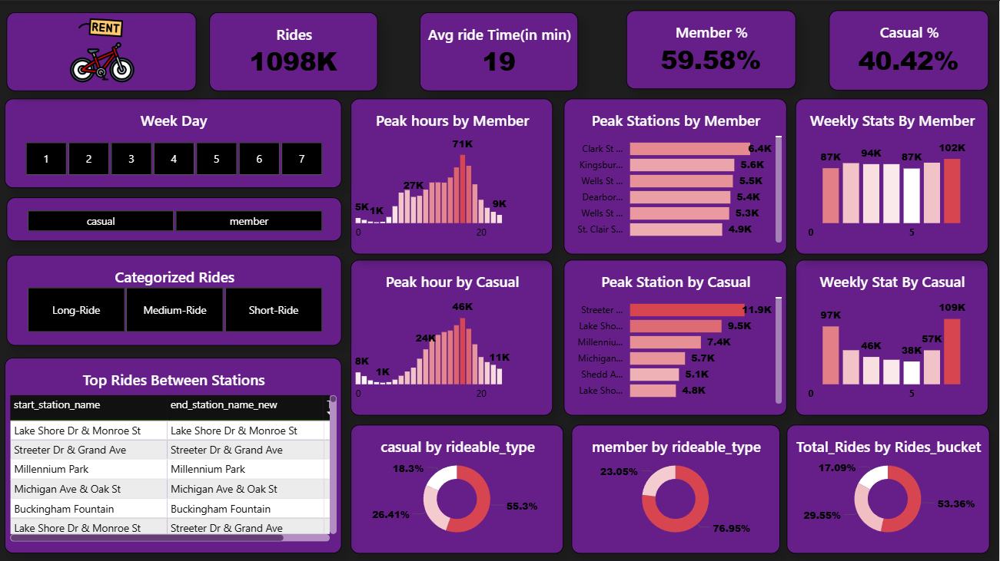

# 🚲 Bike Rental Data Analysis & User Conversion Strategy

## 📌 Project Overview
This project analyzes bike rental data to understand user behavior and identify strategies to convert **casual riders into long-term members**.  

The analysis focuses on usage patterns, ride behavior, peak times, and high-demand locations to generate **data-driven business recommendations**.

---

## 🎯 Objective
- Convert casual users into registered members  
- Increase customer retention and engagement  
- Improve revenue through subscription-based models  

---

## 🗂️ Dataset Description
The dataset contains ride-level information including:

- `ride_id` → Unique ride identifier  
- `rideable_type` → Type of bike (Electric, Classic, Docked)  
- `start_station` → Ride starting location  
- `end_station` → Ride ending location  
- `member_casual` → User type (Member / Casual)  
- `ride_length` → Duration of ride  

---

## 🛠 Tools & Technologies
- **Power BI** → Dashboard creation & visualization  
- **Excel / SQL** → Data cleaning & preprocessing  
- **DAX (Data Analysis Expressions)** → KPI calculations and measures  

---

## 📊 Dashboard Overview
The interactive dashboard provides:

- KPI cards → Total rides, average ride duration, user distribution  
- Time-based analysis → Weekday vs weekend trends  
- Location insights → Top stations by ride volume  
- Ride patterns → Bike type preferences  
- Filters → User type, day of week  

📸 *Dashboard Preview:*  

---

## 📈 Key Metrics
- **Total Rides:** 1.09 Million  
- **Members:** 59.58%  
- **Casual Users:** 40.42%  
- **Average Ride Duration:** 19 minutes  

---

## 🔍 Key Insights

### 👥 User Behavior
- Members are **weekday commuters**  
- Casual users are **weekend leisure riders**  

👉 Insight:  
Members = Habit-driven  
Casual = Experience-driven  

---

### 📅 Time-Based Trends
- Peak usage for casual users → **Weekends & afternoons**  
- Members → **Morning & evening commute hours**  

---

### 📍 Location-Based Insights
Top high-demand stations:
- Streeter Dr & Grand Ave  
- Lake Shore Dr & Monroe St  
- Millennium Park  
- Michigan Ave & Oak St  

👉 These are **tourist hotspots** with high casual user activity  

---

### 🚴 Ride Preferences
- Most used bikes: **Electric & Classic**  
- Casual users → Longer rides (touring behavior)  
- Members → Short, frequent rides  

---

## 💡 Business Recommendations

### 🟡 1. Weekend Conversion Campaigns
- Offer discounts for upgrading to membership after weekend rides  

---

### 🎁 2. Personalized Offers
- Notify users:
  > “You’ve spent ₹X — Save more with membership”  

---

### 📍 3. Location-Based Marketing
- Target high-traffic stations with:
  - QR codes  
  - App notifications  
  - Digital advertisements  

---

### ⚡ 4. Subscription Plans
- Introduce:
  - Electric bike subscription plans  
  - Monthly unlimited ride packages  

---

### 🧠 5. Behavioral Targeting
- Frequent riders → Suggest membership  
- Long-duration users → Recommend premium plans  

---

### 💼 6. Corporate Plans
- Provide office commute subscription packages  

---

### 🎯 7. Loyalty Programs
- Reward repeat users with points and discounts  

---

## 📊 Business Impact
Implementing these strategies can:

- Increase conversion rate of casual users  
- Improve customer retention  
- Generate predictable recurring revenue  
- Strengthen customer loyalty  

---

## 🚀 Future Scope
- Build a **machine learning model** to predict user conversion  
- Develop a **recommendation system** for personalized offers  
- Integrate with a **mobile application** for real-time insights  

---

## 🧾 Conclusion
This project highlights the behavioral differences between casual and member users.  

By leveraging **time-based, location-based, and behavioral insights**, businesses can effectively convert casual riders into long-term members, driving both **growth and sustainability**.

---

## ⭐ Key Takeaway
> “The real value of data lies not in analysis, but in the decisions it enables.”

---

## 🔗 Connect With Me
- 💼 LinkedIn: https://www.linkedin.com/in/sahilmurti07/ 
- 💻 GitHub:  https://github.com/sahilmurti07/DataAnalysisPortfolio
- 📧 Email: sahilmurti18@gmail.com 
